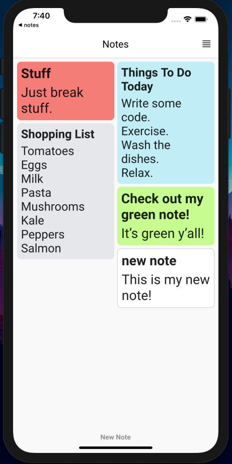

# Notes App

This is a mobile app that lets you create, save and share notes. This is for both Android & IOS.



## Getting Started

To get started using this application, all you need to do is simply clone this repository.

```
git clone [url]
```

### Prerequisites

In order to run this app on your local, you will need to have Flutter installed and set up on your machine.

You can check out the Flutter docs to get up and running: https://flutter.dev/docs/get-started/install

To test if you have Flutter installed and set up correctly simply run:

```
flutter --version
```
or

```
flutter doctor
```

You will also need to install a Android or IOS emulator if you didnt get it with the SDK.

### Installing

Firstly just make sure on your IDE you specify a target device to run the app on or select an emulator and start it up.

Once your Flutter environment is set up, you can simply run the below command in the directory you cloned the app to:

```
flutter run
```
This will install any dependencies and start the app on the selected device emulator.

## Built With

* [Flutter](https://flutter.dev/) - UI Toolkit
* [Sqflite](https://pub.dev/packages/sqflite) - SQL Lite Database
